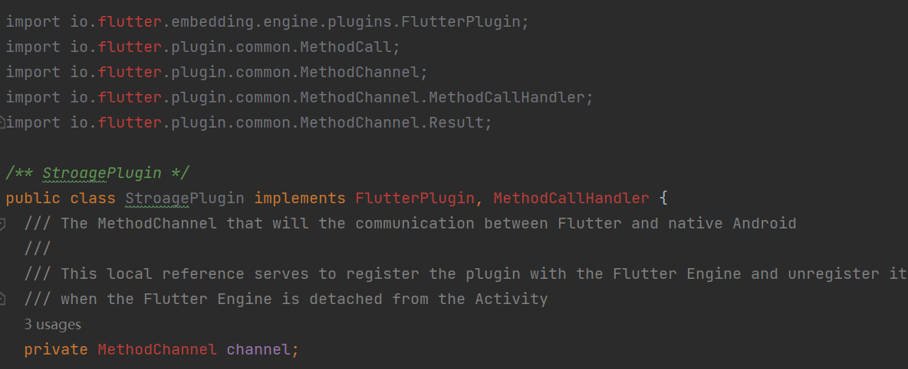
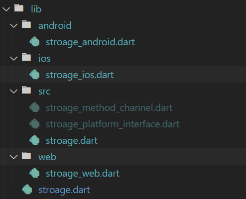
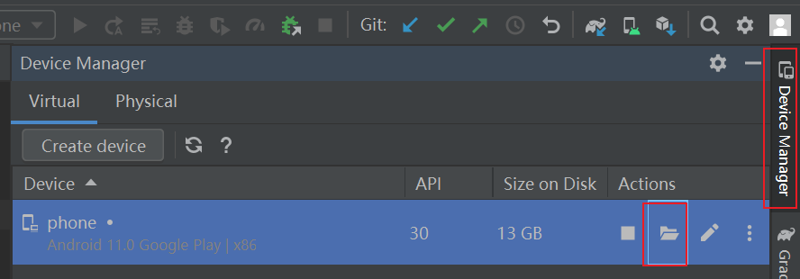

# flutter 插件开发

> 实现 localStorage 的功能

## 创建插件项目

* 创建项目

```shell
flutter create --platforms ios,android --org com.licl -t plugin -i swift -a java stroage
```

* 添加平台

```shell
flutter create -t plugin --platforms <platforms> .
```


---

## 安卓项目

### 引入flutter

> android插件工程是没有引入flutter库的，所以才会出现错误提示，
>
> 在项目根目录建立一个`libs` 文件夹，用来存放 flutter
>
> flutter库地址： flutter_sdk/bin/cache/artifacts/engine



> 在 `build.gradle` 导入依赖

```java
dependencies {
    compileOnly files('libs\\flutter.jar')
    compileOnly "androidx.annotation:annotation:1.0.0"
}
```

> gradle.properties

```properties
android.useAndroidX=true
android.enableJetifier=true
```


---

## 设计模式思考

### 疑问

1. 入口为 `xxxx_platform_interface` 它作为一个抽象类的意义是什么，（只有一个`xxx_method_channel` 继承于 `xxxx_platform_interface`）
2. 为了实现抽象类的意义，是不是可以有多个`method_channel`,完成各个平台功能拆分

3. 完成各个平台功能拆分，flutter 如何区分平台

> 相关文档
>
> [How To Write a Flutter Web Plugin](https://medium.com/flutter/how-to-write-a-flutter-web-plugin-part-2-afdddb69ece6)
>
> [url_launcher](https://github.com/flutter/plugins/tree/8bab180a668a88cb6638721728995e5048cbc7a2/packages/url_launcher)

### 设计模式

> 当该插件需要接入`web`,`window`等平台 或者 `安卓`和`苹果`有一方功能实现流程不同时时，继承于`xxxx_platform_interface`抽象类的意义就会体现出来
>
> 1. 统一各个平台的api标准
> 2. 各个平台代码独立管理
> 3. 平台无法实现某个api时，在抽象层中就返回 `UnimplementedError` ,而不是api实现层


---

### 功能拆分

> 将插件按平台拆分，将原先生成代码文件放在 `src` 中



> 以 `安卓` 为例

1. 创建 `android/stroage_android.dart`，并通过 `registerWith` 注册

```dart
import 'package:flutter/foundation.dart';
import 'package:flutter/services.dart';

import '../src/stroage_platform_interface.dart';

class StroageAndroid extends StroagePlatform {
  @visibleForTesting
  final methodChannel = const MethodChannel('stroage');

  // 通过 registerWith 注册到 StroagePlatform 示例中
  static void registerWith() {
    StroagePlatform.instance = StroageAndroid();
  }

  @override
  Future<String?> getPlatformVersion() async {
    final version =
        await methodChannel.invokeMethod<String>('getPlatformVersion');
    return version;
  }

  @override
  Future<String?> sayHello() async {
    return "StroageAndroid say hello";
  }
}
```

2. 在 `lib/stroage.dart` 中导出

```dart
export 'android/stroage_android.dart';
```

3. 在 `pubspec.yaml` `dartPluginClass` 指定 安卓的插件

```yaml
flutter:
  plugin:
    platforms:
      android:
        package: com.licl.stroage
        pluginClass: StroagePlugin
        dartPluginClass: StroageAndroid
```


---

### 插件功能实现

1. 在 `lib/android/stroage_android.dart` 中, 定义 `get` `set`方法

```dart
class StroageAndroid extends StroagePlatform {
  @visibleForTesting
  final methodChannel = const MethodChannel('stroage');

  // 通过 registerWith 注册到 StroagePlatform 示例中
  static void registerWith() {
    StroagePlatform.instance = StroageAndroid();
  }

  @override
  Future<String?> get(String key) async {
    final value = await methodChannel
        .invokeMethod<String>('get', <String, String>{'key': key});
    return value;
  }

  @override
  Future<String?> set(String key, String value) async {
    await methodChannel.invokeMethod<String>(
        'set', <String, dynamic>{'key': key, 'value': value});
    return null;
  }
}
```

2. 在`android/***/StroagePlugin.java`，实现安卓原生方法

> 因为`SharedPreferences`需要在 `Context`中获取，在 `onAttachedToEngine` 中，通过`FlutterPluginBinding`获取`Context`

```java
  private SharedPreferences preferences;

  @Override
  public void onAttachedToEngine(@NonNull FlutterPluginBinding flutterPluginBinding) {
    preferences=flutterPluginBinding.getApplicationContext().getSharedPreferences("LiclSharedPreferences", Context.MODE_PRIVATE);
  }
```


> onMethodCall: flutter通信方法，在`call`中获取`方法名`与`方法参数`
>
> Result： 用于返回结果

```java
  @Override
  public void  (@NonNull MethodCall call, @NonNull Result result) {
    switch (call.method){
      case "get":{
        result.success("Android " + preferences.getString(call.argument("key"),"安卓中没有数据"));
        break;
      }
      case "set":{
        SharedPreferences.Editor editor = preferences.edit();
        editor.putString(call.argument("key"), call.argument("value"));
        editor.commit();
        result.success("Android set 设置成功" );
        break;
      }
      default:
        result.notImplemented();
        break;
    }
  }
```


---

### 测试

> 可以在模拟器`/data/data/app包名/shared_prefs`中查看



## web

pubspec.yaml

```yaml
# 添加 fluter_web 依赖
dependencies:
  flutter_web_plugins:
    sdk: flutter
    
flutter:
  plugin:
    platforms:
     # 指定 web 入口
      web:
        pluginClass: StroageWeb
        fileName: stroage_web.dart
```


